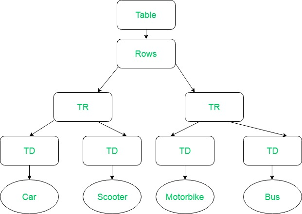

# **DOM (Document Object Model)**

**Introduction**:
The Document Object Model (DOM) is a programming interface for [HTML](https://en.wikipedia.org/wiki/HTML) and [XML](https://en.wikipedia.org/wiki/XML#:~:text=Extensible%20Markup%20Language%20(XML)%20is,free%20open%20standards%E2%80%94define%20XML.)(Extensible markup language) documents. It defines the logical structure of documents and the way a document is accessed and manipulated.

**Note**: It is called a Logical structure because DOM doesn’t specify any relationship between objects.

DOM is a way to represent the webpage in a structured hierarchical way so that it will become easier for programmers and users to go through the document. With DOM, it becomes easy to access and manipulate tags, IDs, classes, Attributes or Elements using commands or methods provided by the Document object.

## **Structure of a DOM**

### *Example: XML*

``` xml
<Table>
   <ROWS>
      <TR>
         <TD>Car</TD>
         <TD>Scooter</TD>
      </TR>
      <TR>
         <TD>MotorBike</TD>
         <TD>Bus</TD>
      </TR>
   </ROWS>
</Table>
```

### **DOM logical tree**



## **Accessing the DOM**

You don't have to do anything special to begin using the DOM. Different browsers have different implementations of the DOM, and these implementations exhibit varying degrees of conformance to the actual DOM standard, but every web browser uses some document object model to make web pages accessible through JavaScript.

When you create a script–whether it's inline in a  `<script>` element or included in the web page by means of a script loading instruction–you can immediately begin using the API for the `document` or `window` elements to manipulate the document itself or to get at the children of that document, which are the various elements in the web page.

This following JavaScript will display an alert when the document is loaded:

``` html
<body onload="window.alert('Welcome to my home page!');">
```

Another example. This function creates a new H1 element, adds text to that element, and then adds the H1 to the tree for this document:

``` html
<html>
  <head>
    <script>
       // run this function when the document is loaded
       window.onload = function() {

         // create a couple of elements in an otherwise empty HTML page
         const heading = document.createElement("h1");
         const heading_text = document.createTextNode("Big Head!");
         heading.appendChild(heading_text);
         document.body.appendChild(heading);
      }
    </script>
  </head>
  <body>
  </body>
</html>
```

## **How To Access Elements in the DOM**

**Introduction**

In Understanding the DOM Tree and Nodes, we went over how the DOM is structured as a tree of objects called nodes, and that nodes can be text, comments, or elements. Usually when we access content in the DOM, it will be through an HTML element node.

To be proficient at accessing elements in the DOM, it is necessary to have a working knowledge of CSS selectors, syntax and terminology as well as an understanding of HTML elements. This are some ways to access elements in the DOM: by ID, class, tag, and query selectors.

**Overview**
|Gets | Selector Syntax | Method |  
|-----------|:-----------:|-----------:|  
|ID |#demo |getElementById()
|Class| .demo |getElementsByClassName()
|Tag |demo |getElementsByTagName()


</br>


## **Some DOM Helper Methods**
**1.DOM getElementById()**</br>
Accesing Elements By Id The `getElementById()` method returns the element that has the ID attribute with the specified value.  
### *Example:getElementById()*
``` javascript
<!DOCTYPE html>
<html>

<body>
    <p id="demo">This text will be replaced by Hello World.</p>
    <script>
        function changeText() {
            document.getElementById("demo").innerHTML = "Hello World";
        }
        changeText();
    </script>
</body>

</html>
``` 
while calling `changeText()` function the contents of `<p>` tag which has the `id="demo"` will be replaced by `Hello World`. 
>Output: 
```
Hello World
```   
</br>

**2.DOM getElementsByClassName()**</br>
The `getElementsByClassName();` method returns a collection of all elements in the document with the specified class name, as an HTMLCollection object. The HTMLCollection object represents a collection of nodes. The nodes can be accessed by index numbers. The index starts at 0.
### *Example: getElementsByClassName()*
``` javascript
<!DOCTYPE html>
<html>

<body>

    <div class="example">First div element with class="example".</div>

    <div class="example">Second div element with class="example".</div>

    <script>
        function updateDivs() {
            var x = document.getElementsByClassName("example");
            x[0].innerHTML = "Hello World!";
            x[1].innerHTML = "Hi this is Vivek!!";
        }
        updateDivs();
    </script>

</body>

</html>
```
Here we have defined two `<div>` with same `className` Hence, we can access each `<div>` with the help of variable `x` using the concept of indexing. and can update the content of each tags separately. 
>Output
``` html
Hello World!
Hi this is Vivek!!
```
**3.DOM getElementsByTagName()**</br>
Accesing Elements By TagName The `getElementsByTagName()` method returns a collection of all elements in the document with the specified tag name, as an HTMLCollection object. </br>

### *Example:getElementByTagName()* 
``` javascript
<!DOCTYPE html>
<html>

<body>
    <p>An ordered list:</p>
    <ol>
        <li>Coffee</li>
        <li>Tea</li>
        <li>Milk</li>
    </ol> 
    <p id="demo"></p>
    <script>
        function getItem() {
            var x = document.getElementsByTagName("LI");
            document.getElementById("demo").innerHTML = x[1].innerHTML;
        }
        getItem();
    </script>
</body>

</html>

``` 
while calling `getItem()` function ,we are getting collection of `<li>` tags and by accessing it through indexing we can manipulate the content inside each`<li>` tags separately, Here we are updating the content of paragraph with the 2nd index(Tea).
>output

  ```
  An ordered list:

      1.Coffee
      2.Tea
      3.Milk
Tea
  ```
    
>References

1. what is [DOM](https://www.youtube.com/watch?v=ipkjfvl40s0&t=109s)?
2. CheckOut [this](https://www.geeksforgeeks.org/dom-document-object-model/) Amazing Article About DOM, on geekforgeeks.

3. To Know More about aceessing the DOM Elements [click](https://www.digitalocean.com/community/tutorials/how-to-access-elements-in-the-dom#:~:text=Accessing%20Elements%20by%20ID,method%20of%20the%20document%20object.&text=In%20order%20to%20be%20accessed,must%20have%20an%20id%20attribute.)
4. Some [More](https://www.youtube.com/watch?v=y17RuWkWdn8) DOM Manipulation.
